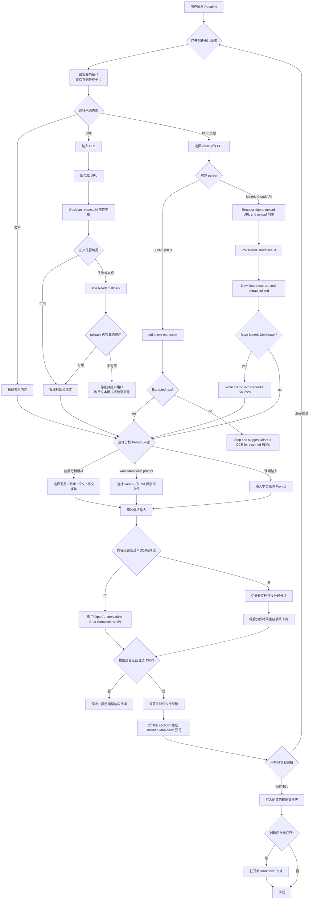
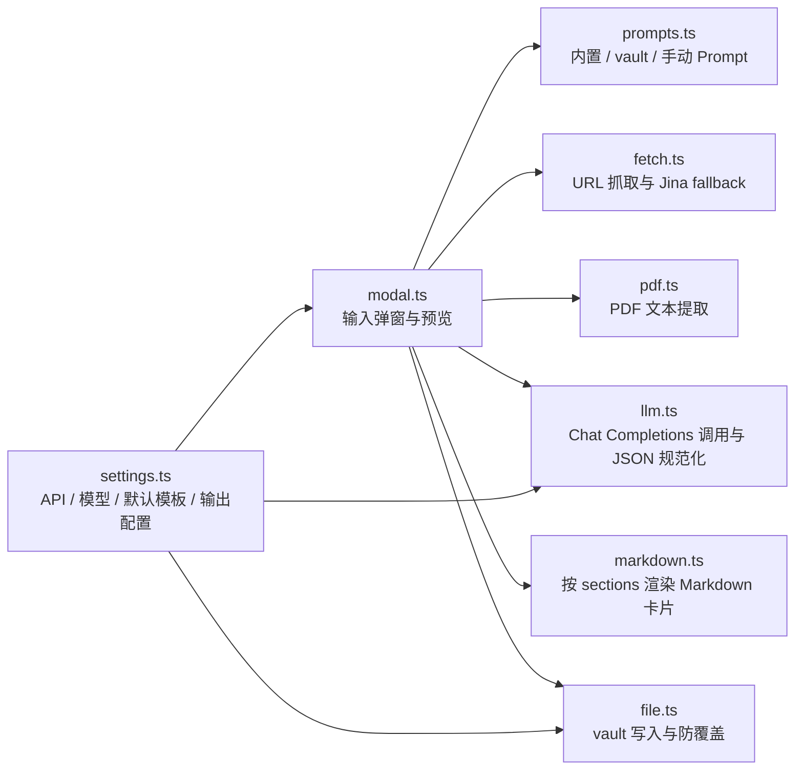
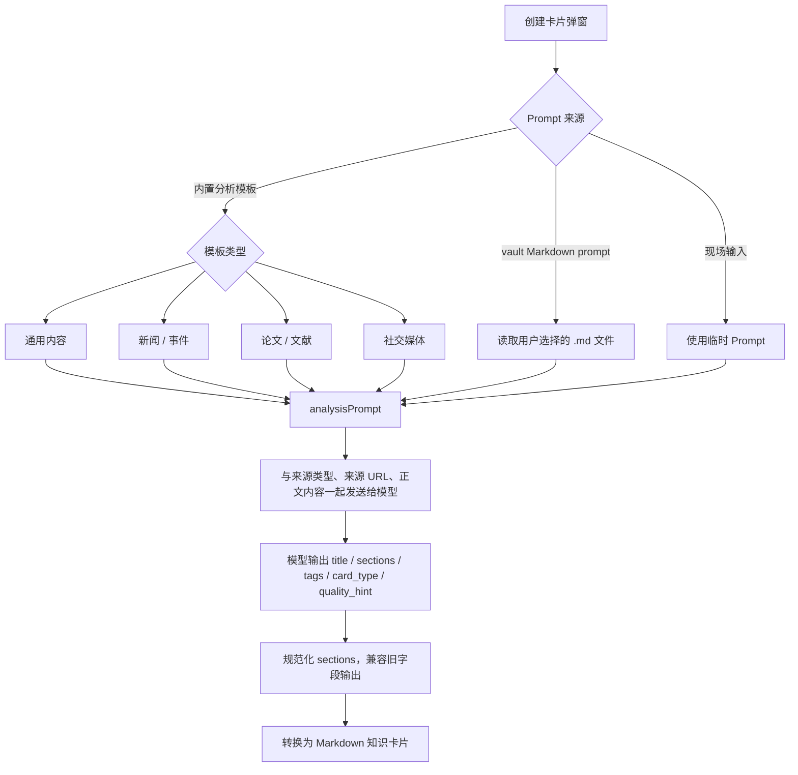
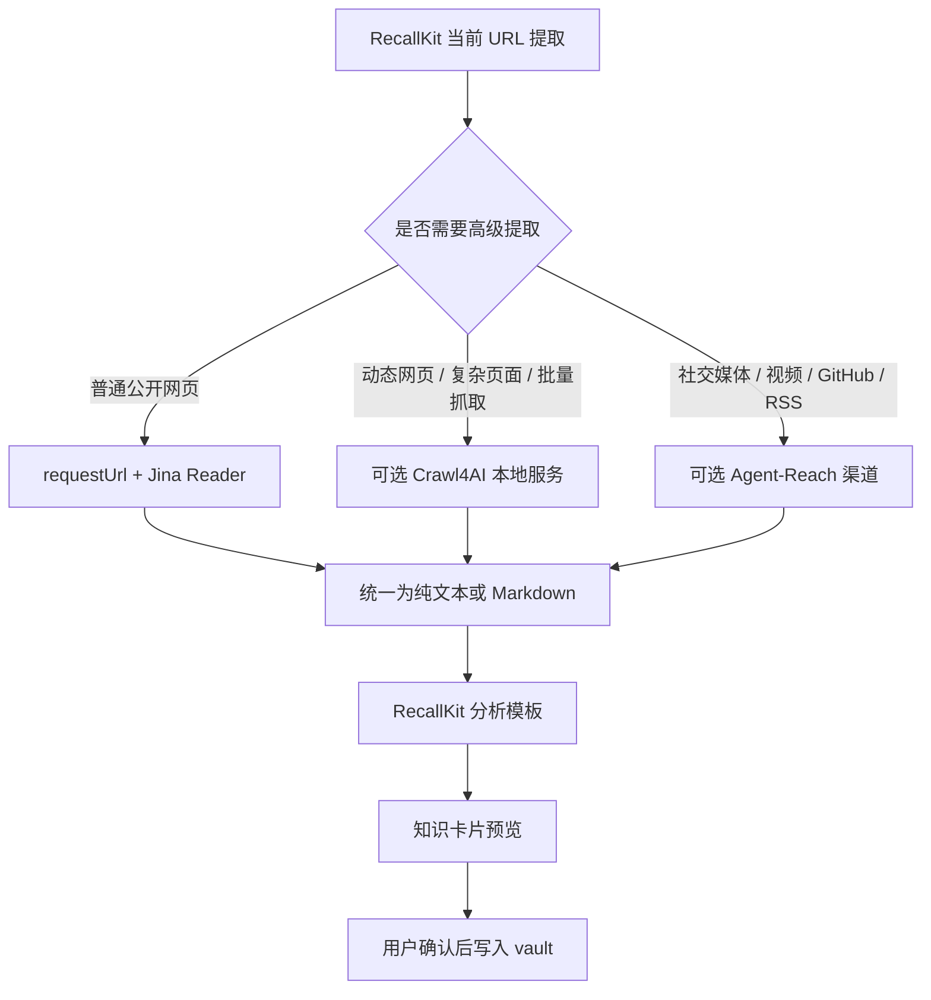

# RecallKit 插件 Workflow

最后更新：2026-05-02

## 当前主流程

## 2026-05-02 PDF parsing update

PDF input has two parser paths:

- Built-in pdf.js: local text extraction for text-based PDFs.
- MinerU Cloud API: signed upload -> batch polling -> result zip download -> `full.md` extraction -> optional vault save -> existing RecallKit card analysis.

## 模块职责

## 当前 Prompt 工程流程

## 未来扩展点

